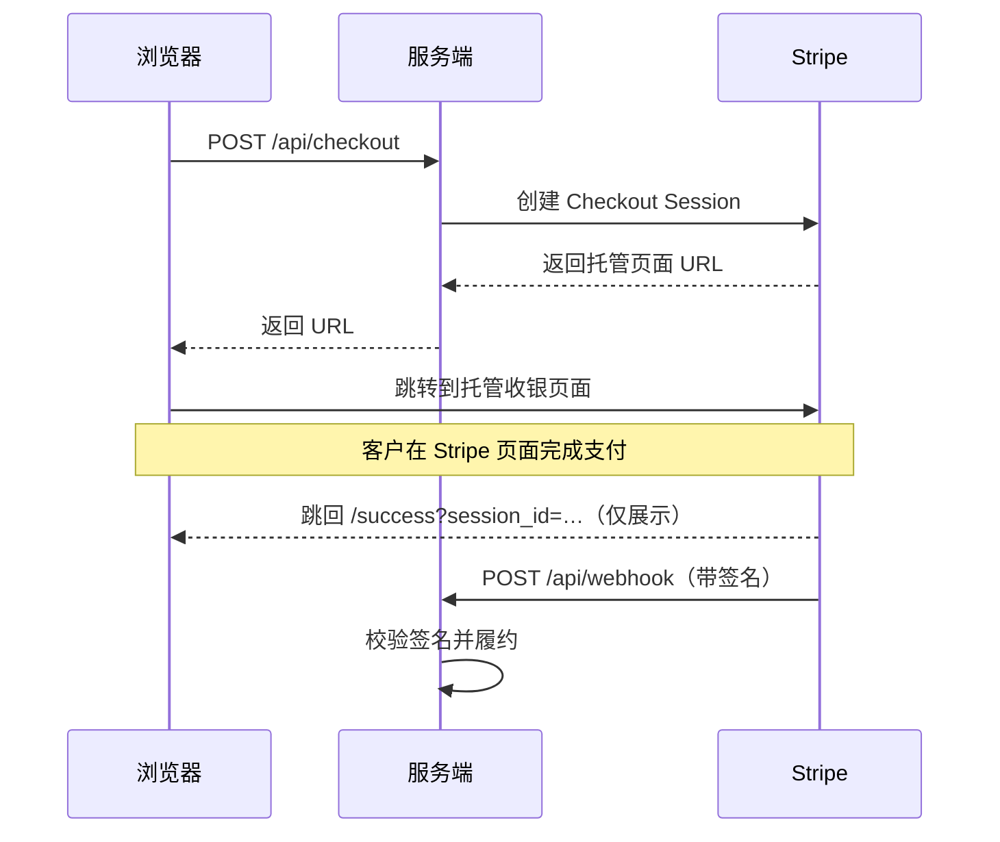

# Stripe Checkout Session Demo

一个最小化的 [Next.js](https://nextjs.org)（App Router）商店，使用
[Stripe Checkout](https://stripe.com/docs/payments/checkout) 完成一次性收款。
点击 **Buy**，在 Stripe 托管页面上完成支付，然后跳回确认页 —— 订单履约由经过签名
校验的 webhook 驱动。

## 工作原理



- **价格保存在服务端**（[src/lib/products.ts](src/lib/products.ts)），因此扣款金额
  不可能被浏览器端篡改。
- **成功页只负责展示** —— 真正的履约发生在签名校验过的 webhook 里，绝不依赖 URL
  上的 `session_id`。

## 项目结构

| 路径                                                            | 用途                                        |
| --------------------------------------------------------------- | ------------------------------------------- |
| [src/lib/stripe.ts](src/lib/stripe.ts)                         | 共享的 Stripe 客户端（锁定 API 版本）        |
| [src/lib/products.ts](src/lib/products.ts)                     | 服务端商品目录，价格的唯一可信来源            |
| [src/app/api/checkout/route.ts](src/app/api/checkout/route.ts) | 创建 Checkout Session，返回托管页面 URL      |
| [src/app/api/webhook/route.ts](src/app/api/webhook/route.ts)   | 校验 Stripe 事件签名并履约                   |
| [src/app/page.tsx](src/app/page.tsx)                           | 商品列表页，含商品卡片与数量选择              |
| [src/app/success/page.tsx](src/app/success/page.tsx)           | 支付完成后的确认页                           |
| [src/app/cancel/page.tsx](src/app/cancel/page.tsx)             | 客户取消支付时展示                           |

## 环境搭建

1. **安装依赖**

   ```bash
   npm install
   ```

2. **配置环境变量**

   ```bash
   cp .env.example .env.local
   ```

   填入你的[测试 API key](https://dashboard.stripe.com/test/apikeys)：

   | 变量                                 | 说明                                  |
   | ------------------------------------ | ------------------------------------- |
   | `NEXT_PUBLIC_STRIPE_PUBLISHABLE_KEY` | Publishable key（`pk_test_…`）        |
   | `STRIPE_SECRET_KEY`                  | Secret key（`sk_test_…`）             |
   | `STRIPE_WEBHOOK_SECRET`              | Webhook 签名密钥（`whsec_…`，见下文） |
   | `NEXT_PUBLIC_APP_URL`                | 用于拼接跳转地址的站点根 URL           |

3. **启动开发服务器**

   ```bash
   npm run dev
   ```

   打开 [http://localhost:3030](http://localhost:3030)。

## 本地调试 webhook

Webhook 事件（也就是订单履约）需要
[Stripe CLI](https://stripe.com/docs/stripe-cli)。在第二个终端里运行：

```bash
npm run stripe:listen
```

它会把事件转发到 `localhost:3030/api/webhook`，并打印一个 `whsec_…` 密钥 ——
把它填进 `STRIPE_WEBHOOK_SECRET`，然后重启 `npm run dev`。

## 测试卡号

在托管收银页面上使用 Stripe 的[测试卡](https://stripe.com/docs/testing)：

| 卡号                  | 结果                 |
| --------------------- | -------------------- |
| `4242 4242 4242 4242` | 支付成功             |
| `4000 0000 0000 9995` | 支付被拒（余额不足） |
| `4000 0025 0000 3155` | 需要 3D Secure 验证  |

有效期填未来任意日期，CVC 填任意 3 位数字，邮编任意。

## 上生产环境

- 把测试 key 换成正式 key，并在
  [Stripe Dashboard](https://dashboard.stripe.com/webhooks) 注册指向
  `https://your-domain/api/webhook` 的 webhook 端点。
- 让 webhook 处理逻辑**幂等**，并把订单落库 —— 参见
  [src/app/api/webhook/route.ts](src/app/api/webhook/route.ts) 里的 `TODO`。
- 把 `NEXT_PUBLIC_APP_URL` 设为你部署后的域名。

## 脚本

| 命令                    | 说明                         |
| ----------------------- | ---------------------------- |
| `npm run dev`           | 启动开发服务器               |
| `npm run build`         | 生产构建                     |
| `npm run start`         | 运行生产构建                 |
| `npm run stripe:listen` | 把 Stripe webhook 转发到本地 |
