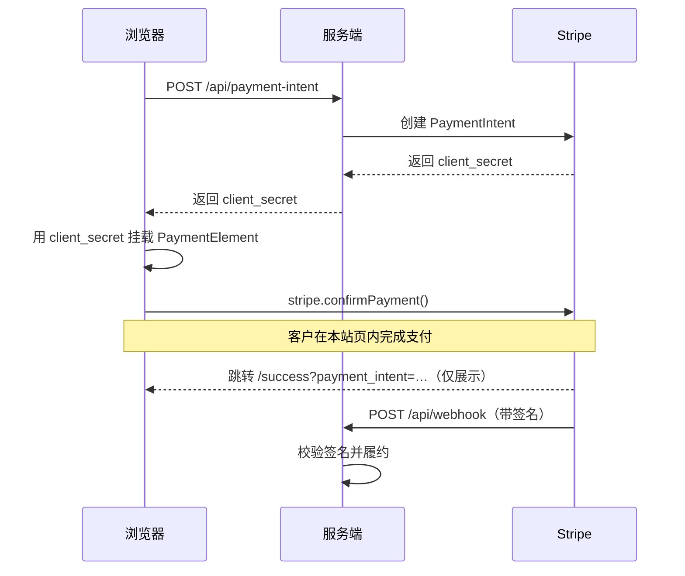
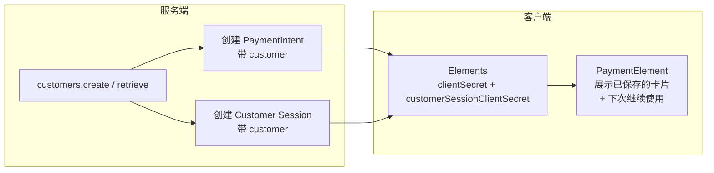

# Stripe Payment Element Demo

一个最小化的 [Next.js](https://nextjs.org)（App Router）商店，使用
[Stripe Elements](https://stripe.com/docs/payments/payment-element) 完成一次性收款
—— 也就是**内嵌式**收银台。不跳转到 Stripe 托管页面，客户直接在我们自己的
`/checkout` 页面上通过 Payment Element 填写卡号。

> 与 **Stripe Checkout（托管跳转）** demo 互为对照。商品目录和基于 webhook 的
> 履约逻辑完全相同，只有支付层不一样，方便你横向比较两种接入方式。

## 托管 Checkout vs. 内嵌 Elements

|              | Checkout（托管）                    | Elements（本项目）                              |
| ------------ | ----------------------------------- | ----------------------------------------------- |
| 卡号在哪里输入 | Stripe 托管页面（跳出站点）          | 自己的页面，内联渲染                             |
| 服务端创建   | **Checkout Session**（返回一个 URL） | **PaymentIntent**（返回 client secret）          |
| 客户端 SDK   | 无（浏览器直接跳转 URL）             | `@stripe/stripe-js` + `@stripe/react-stripe-js` |
| Webhook 事件 | `checkout.session.completed`        | `payment_intent.succeeded`                      |
| UI 控制权    | 很小（页面归 Stripe 管）             | 完全（样式和布局都由你决定）                     |

## 工作原理



- **价格保存在服务端**（[src/lib/products.ts](src/lib/products.ts)），因此扣款金额
  不可能被浏览器端篡改。
- **成功页只负责展示** —— 真正的履约发生在签名校验过的 webhook 里，由
  `payment_intent.succeeded` 触发，绝不依赖 URL 上的 id。

## 保存的支付方式

Payment Element 可以让回访客户**直接用之前保存的卡付款**，也可以提示保存新卡，
而我们不需要自己写任何卡片管理界面。这依赖服务端两样东西：

1. 一个 **Stripe Customer**。保存的卡属于某个 customer，所以需要一个跨访问稳定的
   customer id。本 demo 没有账号体系，因此把 id 存在 cookie 里
   （[src/lib/customer.ts](src/lib/customer.ts)）；真实应用应当从已登录用户身上取。
   创建 PaymentIntent 时会带上这个 `customer`。
2. 一个 **Customer Session**
   （[src/app/api/payment-intent/route.ts](src/app/api/payment-intent/route.ts)），
   它的 client secret 会和 PaymentIntent 一起传给 `<Elements>`。开启
   `payment_element` 相关特性后，组件会自动渲染已保存的卡片、
   **“保存支付信息以便下次使用”** 复选框，以及删除按钮 —— 全部在客户端完成。



客户勾选复选框后，Stripe 会在 intent 上设置 `setup_future_usage`
（对应 `payment_method_save_usage: 'off_session'`），卡片因此被保存并可复用。
你可以用 `4242 4242 4242 4242` 支付一次并勾上该选项，然后在同一浏览器里重新打开
`/checkout` —— 保存的卡片就会出现在最上方。

## 项目结构

| 路径                                                                        | 用途                                                    |
| -------------------------------------------------------------------------- | ------------------------------------------------------- |
| [src/lib/stripe.ts](src/lib/stripe.ts)                                     | 共享的**服务端** Stripe 客户端（锁定 API 版本）          |
| [src/lib/stripe-client.ts](src/lib/stripe-client.ts)                       | **浏览器端** Stripe.js 加载器（publishable key，带缓存） |
| [src/lib/products.ts](src/lib/products.ts)                                 | 服务端商品目录，价格的唯一可信来源                       |
| [src/lib/customer.ts](src/lib/customer.ts)                                 | 获取或创建 Stripe Customer（cookie 承载），用于保存卡片  |
| [src/app/api/payment-intent/route.ts](src/app/api/payment-intent/route.ts) | 创建 PaymentIntent，返回 client secret                   |
| [src/app/api/webhook/route.ts](src/app/api/webhook/route.ts)               | 校验 Stripe 事件签名并履约                               |
| [src/app/page.tsx](src/app/page.tsx)                                       | 商品列表页，含商品卡片与数量选择                         |
| [src/app/checkout/page.tsx](src/app/checkout/page.tsx)                     | 内嵌 Payment Element 表单（`<Elements>` + 确认支付）     |
| [src/app/success/page.tsx](src/app/success/page.tsx)                       | 支付完成后的确认页                                       |

## 环境搭建

1. **安装依赖**

   ```bash
   npm install
   ```

2. **配置环境变量**

   ```bash
   cp .env.example .env.local
   ```

   填入你的[测试 API key](https://dashboard.stripe.com/test/apikeys)：

   | 变量                                 | 说明                                    |
   | ------------------------------------ | --------------------------------------- |
   | `NEXT_PUBLIC_STRIPE_PUBLISHABLE_KEY` | Publishable key（`pk_test_…`）          |
   | `STRIPE_SECRET_KEY`                  | Secret key（`sk_test_…`）               |
   | `STRIPE_WEBHOOK_SECRET`              | Webhook 签名密钥（`whsec_…`，见下文）   |
   | `NEXT_PUBLIC_APP_URL`                | 用于拼接支付返回地址的站点根 URL         |

3. **启动开发服务器**

   ```bash
   npm run dev
   ```

   打开 [http://localhost:3040](http://localhost:3040)。

## 本地调试 webhook

Webhook 事件（也就是订单履约）需要
[Stripe CLI](https://stripe.com/docs/stripe-cli)。在第二个终端里运行：

```bash
npm run stripe:listen
```

它会把事件转发到 `localhost:3040/api/webhook`，并打印一个 `whsec_…` 密钥 ——
把它填进 `STRIPE_WEBHOOK_SECRET`，然后重启 `npm run dev`。

## 测试卡号

直接在内嵌的 Payment Element 中输入：

| 卡号                  | 结果                     |
| --------------------- | ------------------------ |
| `4242 4242 4242 4242` | 支付成功                 |
| `4000 0000 0000 9995` | 支付被拒（余额不足）     |
| `4000 0025 0000 3155` | 需要 3D Secure 验证      |

有效期填未来任意日期，CVC 填任意 3 位数字，邮编任意。

## 上生产环境

- 把测试 key 换成正式 key，并在
  [Stripe Dashboard](https://dashboard.stripe.com/webhooks) 注册指向
  `https://your-domain/api/webhook` 的 webhook 端点，订阅 `payment_intent.succeeded`。
- 让 webhook 处理逻辑**幂等**，并把订单落库 —— 参见
  [src/app/api/webhook/route.ts](src/app/api/webhook/route.ts) 里的 `TODO`。
- 把 `NEXT_PUBLIC_APP_URL` 设为你部署后的域名。

## 脚本

| 命令                    | 说明                           |
| ----------------------- | ------------------------------ |
| `npm run dev`           | 启动开发服务器（端口 3040）    |
| `npm run build`         | 生产构建                       |
| `npm run start`         | 运行生产构建                   |
| `npm run stripe:listen` | 把 Stripe webhook 转发到本地   |
